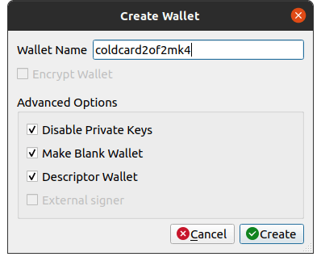
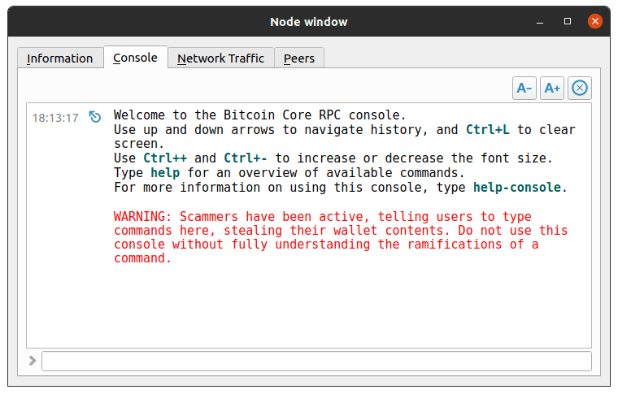
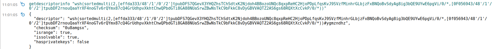
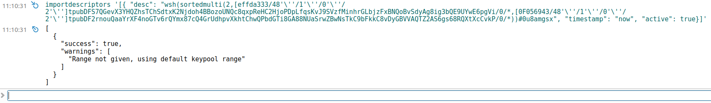
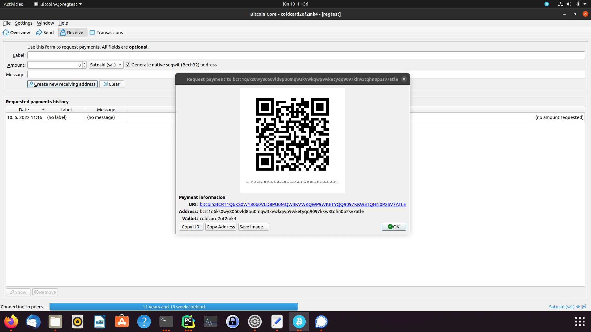
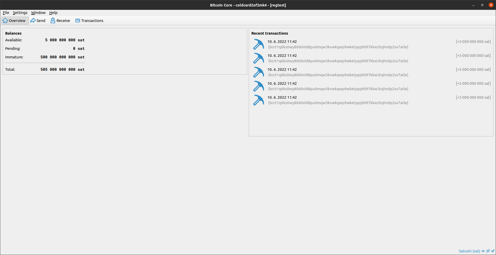
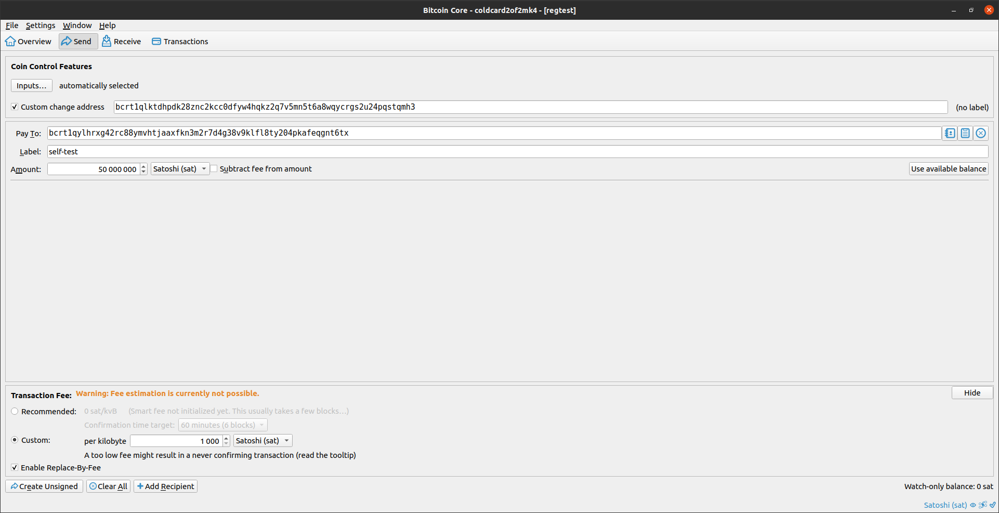
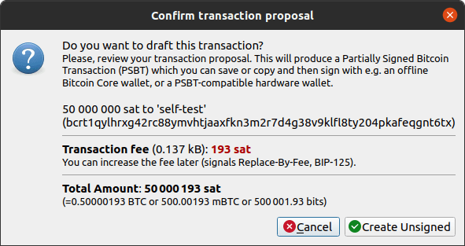
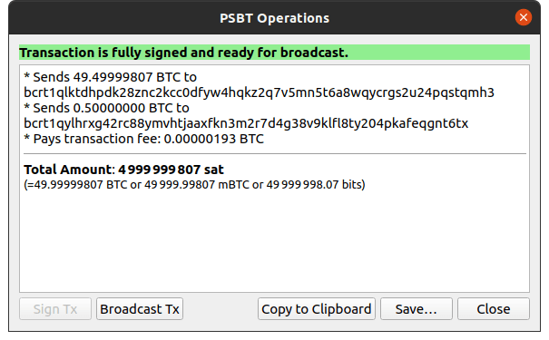

## Airgapped 2of2 Multisig with Bitcoin Core (and descriptors)

#### Prerequisites
* Coldcard Mk4
* SD card and SD card reader (or NFC reader)
* bitcoind (min version v22.0)
* [jq](https://stedolan.github.io/jq/)


### Tutorial 1
2of2 with one Mk4 hww and bitcoind sww (+ bitcoind watch only wallet as a coordinator)

1. start bitcoind (here I will use regtest)
```shell
bitcoind -regtest
```
2. Create descriptor wallet with private keys enabled. This wallet will be used for signing (1of2)
```shell
bitcoin-cli -regtest createwallet "signer"
# if using core older than v23.0 you need to specify descriptor wallet as below
bitcoin-cli -regtest help  createwallet "signer" false false "__strong-random_password&%4568479" false true
```
3. Create watch-only descriptor wallet. This wallet will contain watch-only multisig descriptor (coordinator)
```shell
bitcoin-cli -regtest  createwallet "watch_only" true true
# if older than v23.0
bitcoin-cli -regtest  createwallet "watch_only" true true "" false true
```
4. Get descriptor from Coldcard Mk4 (Settings->Multisig Wallets->Eport XPUB)
5. Step 4. produced a text file on SD card or in your  .... as we will be creating wsh multisig get `p2wsh_desc` key from produced file (should start with ccxp-<xfp>.json). Should look like this:
```shell
"wsh(sortedmulti(M,[0F056943/48'/1'/0'/2']tpubDF2rnouQaaYrXF4noGTv6rQYmx87cQ4GrUdhpvXkhtChwQPbdGTi8GA88NUaSrwZBwNsTkC9bFkkC8vDyGBVVAQTZ2AS6gs68RQXtXcCvkP/0/*,...))"
```
6. Above descriptor template needs to be filled with information form other signers (in our case only bitcoind). Specifically one must add all extended keys with key origin info and substitute `M` with treshold value.
7. Bitcoin (unfortunately) does not support deriving xpubs at will, so we will use legacy derivations path which we can get from `listdescriptors`
```shell
$ bitcoin-cli -regtest -rpcwallet="signer" listdescriptors
{
  "wallet_name": "signer",
  "descriptors": [
    {
      "desc": "pkh([64366408/44'/1'/0']tpubDCXQ3To3NsuzoTL2VsEFEGohQqnWFRHjno6axLhJf2HASarkm3ckwiBZoeo2Fg1iD6eLeEZ4eSnrteJzNsvR2xAZ3tm4mPottVvsnxrxGWk/0/*)#dp00ujja",
      "timestamp": 1653567924,
      "active": true,
      "internal": false,
      "range": [
        0,
        999
      ],
      "next": 0
    },
    {
      "desc": "wpkh([64366408/84'/1'/0']tpubDCP8Ur7JZGT6DbepXqahQwh5oAVhimEaMcLMb1pTMnbM7XvpY4BVocLrefbaChs2zvuHJesfurqhsGcJRQP6kwEvsdCuwefaUmZJeTETUbt/0/*)#r2nthvgn",
      "timestamp": 1653567924,
      "active": true,
      "internal": false,
      "range": [
        0,
        999
      ],
      "next": 0
    },
    ...
  ]
}
```
9. Copy extended key (with key origin and derivation information) from `pkh` descriptor (shown below)
```shell
[64366408/44'/1'/0']tpubDCXQ3To3NsuzoTL2VsEFEGohQqnWFRHjno6axLhJf2HASarkm3ckwiBZoeo2Fg1iD6eLeEZ4eSnrteJzNsvR2xAZ3tm4mPottVvsnxrxGWk/0/*
```
10. Insert above to the multisig descriptor from step 5. and replace M with 2
11. Use bitcoind to calculate descriptor checsum
```shell
$ bitcoin-cli -regtest getdescriptorinfo "wsh(sortedmulti(2,[0F056943/48'/1'/0'/2']tpubDF2rnouQaaYrXF4noGTv6rQYmx87cQ4GrUdhpvXkhtChwQPbdGTi8GA88NUaSrwZBwNsTkC9bFkkC8vDyGBVVAQTZ2AS6gs68RQXtXcCvkP/0/*,[64366408/44'/1'/0']tpubDCXQ3To3NsuzoTL2VsEFEGohQqnWFRHjno6axLhJf2HASarkm3ckwiBZoeo2Fg1iD6eLeEZ4eSnrteJzNsvR2xAZ3tm4mPottVvsnxrxGWk/0/*))"
{
  "descriptor": "wsh(sortedmulti(2,[0f056943/48'/1'/0'/2']tpubDF2rnouQaaYrXF4noGTv6rQYmx87cQ4GrUdhpvXkhtChwQPbdGTi8GA88NUaSrwZBwNsTkC9bFkkC8vDyGBVVAQTZ2AS6gs68RQXtXcCvkP/0/*,[64366408/44'/1'/0']tpubDCXQ3To3NsuzoTL2VsEFEGohQqnWFRHjno6axLhJf2HASarkm3ckwiBZoeo2Fg1iD6eLeEZ4eSnrteJzNsvR2xAZ3tm4mPottVvsnxrxGWk/0/*))#u9kn5t5z",
  "checksum": "2a4prgc8",
  "isrange": true,
  "issolvable": true,
  "hasprivatekeys": false
}
```
12. Copy descriptor with checksum to new file (2of2core.txt) on SD card (descriptor has to be in single line)
13. Insert SD card to Coldcard and import multisig wallet.(Settings->Multisig Wallets->Import from file) select 2of2core.txt and approve.
14. Import descriptor to watch_only wallet (signer would not allow us as he has private keys)
```shell
# mind the quoting
bitcoin-cli -regtest -rpcwallet=watch_only importdescriptors '[{ "desc": "wsh(sortedmulti(2,[0f056943/48'\''/1'\''/0'\''/2'\'']tpubDF2rnouQaaYrXF4noGTv6rQYmx87cQ4GrUdhpvXkhtChwQPbdGTi8GA88NUaSrwZBwNsTkC9bFkkC8vDyGBVVAQTZ2AS6gs68RQXtXcCvkP/0/*,[64366408/44'\''/1'\''/0'\'']tpubDCXQ3To3NsuzoTL2VsEFEGohQqnWFRHjno6axLhJf2HASarkm3ckwiBZoeo2Fg1iD6eLeEZ4eSnrteJzNsvR2xAZ3tm4mPottVvsnxrxGWk/0/*))#u9kn5t5z", "timestamp": "now", "active": true}]'
```
15. Get address and get some funds
```shell
$ bitcoin-cli -regtest -rpcwallet=watch_only  getnewaddress
bcrt1qxztjwu7ellu9c3ec3vxp2t6uw0z8dugha3tcfmz8nhhvmluk2ljshae587
```
16. If you use regtest as I do, make sure to set Coldcard to regtest (Advanced/Tools-> Danger Zone->Testnet Mode->Regtest)
17. Check that core generated address matches with address generated by Coldcard (Address Explorer->multi_2of2_core)
18. Fund address
```shell
# this is only useful for those who use regtest - if you're on testnet use faucet
bitcoin-cli -regtest -rpcwallet=watch_only  generatetoaddress 101 "bcrt1qxztjwu7ellu9c3ec3vxp2t6uw0z8dugha3tcfmz8nhhvmluk2ljshae587"
```
19. Generate change address and get destination address to send to (in our case another `getnewaddress` -> self spend)
```shell
bitcoin-cli -regtest -rpcwallet=watch_only getnewaddress
```
20. Create PSBT
```shell
# we need to use change address as we do not support change descriptor - yet
psbt=$(bitcoin-cli -regtest -rpcwallet=watch_only walletcreatefundedpsbt '[]' '[{"bcrt1q3r5lrq2jnhpey58amft60daaj8z3hmjdrdq97xy5fvcc5yxh9uysvmnpfl": 25.0}]' 0 '{"fee_rate": 20, "changeAddress": "bcrt1q2uzxy5qa47jpdjzzkfyg6hj7tlhzj7m4dve4ca6d0kqh6cw0wkrqews9y7"}' | jq -r '.psbt')
```
21. Sign with core (signer wallet)
```shell
psbt_core_signed=$(bitcoin-cli -regtest -rpcwallet=signer walletprocesspsbt $psbt | jq -r '.psbt')
```
22. Get half signed PSBT to Coldcard (via SD card or NFC) for signing
```shell
# move half signed PSBT to micro SD card (must end with .psbt)
echo $psbt_core_signed > /media/MicroSD/core_signed.psbt
```
23. On Coldcard (Ready To Sign) verify transaction (check addresses, amounts...) and sign. Coldcard will produce `core_signed-part.psbt`. Copy this file back to PC.
24. Finalize and send
```shell
bitcoin-cli -regtest finalizepsbt "<copy psbt here>"
bitcoin-cli -regtest testmempoolaccept '["<tx hex>"]'
bitcoin-cli -regtest sendrawtransaction <tx hex>
```

### Tutorial 2
2of2 with two Mk4 hww (+ bitcoin-qt watch only wallet as a coordinator)
1. start bitcoin-qt (here I will use regtest)
```shell
bitcoin-qt -regtest
```

2. Create wallet with: disabled private keys, blank, descriptors



4. Get descriptor from Coldcard Mk4 (Settings->Multisig Wallets->Export XPUB)
5. Step 4. produced a text file on SD card or in your  .... as we will be creating wsh multisig get `p2wsh_desc` key from produced file (should start with ccxp-<xfp>.json). Should look like this:
```shell
"wsh(sortedmulti(M,[0F056943/48'/1'/0'/2']tpubDF2rnouQaaYrXF4noGTv6rQYmx87cQ4GrUdhpvXkhtChwQPbdGTi8GA88NUaSrwZBwNsTkC9bFkkC8vDyGBVVAQTZ2AS6gs68RQXtXcCvkP/0/*,...))"
```
6. Above descriptor template needs to be filled with information form other signers. Specifically one must add all extended keys with key origin info and substitute `M` with treshold value.
7. repeat steps 4 to 6 as many times as many signers (N) participate
8. Compile descriptor with keys retrieved from signing devices and replace M with desired treshold. Below is my wsh descriptor compiled from two Coldcards Mk4.
```shell
"wsh(sortedmulti(2,[effda333/48'/1'/0'/2']tpubDFS7QGevX3YHQZhsTChSdtxK2Njdoh4BBozoUNQc8qxpReHC2HjoPDpLfqsKvJ9SVzfMinhrGLbjzFxBNQoBvSdyAg8ig3bQE9UYwE6pgVi/0/*,[0F056943/48'/1'/0'/2']tpubDF2rnouQaaYrXF4noGTv6rQYmx87cQ4GrUdhpvXkhtChwQPbdGTi8GA88NUaSrwZBwNsTkC9bFkkC8vDyGBVVAQTZ2AS6gs68RQXtXcCvkP/0/*))"
```
9. Go back to bitcoin-qt, open console (Window->Console) and paste prepared descriptor to `getdescriptorinfo` command



```shell
$ getdescriptorinfo "wsh(sortedmulti(2,[effda333/48'/1'/0'/2']tpubDFS7QGevX3YHQZhsTChSdtxK2Njdoh4BBozoUNQc8qxpReHC2HjoPDpLfqsKvJ9SVzfMinhrGLbjzFxBNQoBvSdyAg8ig3bQE9UYwE6pgVi/0/*,[0F056943/48'/1'/0'/2']tpubDF2rnouQaaYrXF4noGTv6rQYmx87cQ4GrUdhpvXkhtChwQPbdGTi8GA88NUaSrwZBwNsTkC9bFkkC8vDyGBVVAQTZ2AS6gs68RQXtXcCvkP/0/*))"
```


10. Copy descriptor with checksum to new file (2of2mk4.txt) on SD card (descriptor has to be in single line)
11. Insert SD card to both Coldcard signing devices and import multisig wallet.(Settings->Multisig Wallets->Import from file) select 2of2mk4.txt and approve.
12. Go to bitcoin-qt console (Window->Console) and paste prepared descriptor to importdescriptor command
```shell
# do not forget to quote properly
importdescriptors '[{ "desc": "wsh(sortedmulti(2,[effda333/48'\''/1'\''/0'\''/2'\'']tpubDFS7QGevX3YHQZhsTChSdtxK2Njdoh4BBozoUNQc8qxpReHC2HjoPDpLfqsKvJ9SVzfMinhrGLbjzFxBNQoBvSdyAg8ig3bQE9UYwE6pgVi/0/*,[0F056943/48'\''/1'\''/0'\''/2'\'']tpubDF2rnouQaaYrXF4noGTv6rQYmx87cQ4GrUdhpvXkhtChwQPbdGTi8GA88NUaSrwZBwNsTkC9bFkkC8vDyGBVVAQTZ2AS6gs68RQXtXcCvkP/0/*))#0u8amgsx", "timestamp": "now", "active": true}]'
```


13. Go to bitcoin-qt for new receiving address (Receive->Create new receiving address))



16. If you use regtest as I do, make sure to set Coldcard to regtest (Advanced/Tools-> Danger Zone->Testnet Mode->Regtest)
17. Check that core generated address matches with address generated by both Coldcards (Address Explorer->2of2mk4)
18. Fund address (via bitcoin-qt console)
```shell
# this is only useful for those who use regtest - if you're on testnet use faucet
generatetoaddress 101 "bcrt1qxztjwu7ellu9c3ec3vxp2t6uw0z8dugha3tcfmz8nhhvmluk2ljshae587"
```
19. after above command one should see usable balance in his wallet



20. Generate change address and get destination address to send to (in our case repeat step 13. twice (receive, change))
21. Create funded PSBT in bitcoin-qt. Go to Send and fill the values (customchange address, pay to, label, amount, fee) and hit `Create unsigned` button



22. Create unsigned and save to disk



23. Move unsigned PSBT to 1. Coldcard (Ready To Sign) verify transaction (check addresses, amounts...) and sign. Coldcard will produce `self-test-50000000sat-part.psbt`. Move SD card to 2. Coldcard and sign again. Move SD card back to PC.
24. Go to bitcoin-qt app choose File->Load PSBT from file and choose PSBT signed with both Coldcards



25. Hit `Broadcast TX` button and you're DONE.