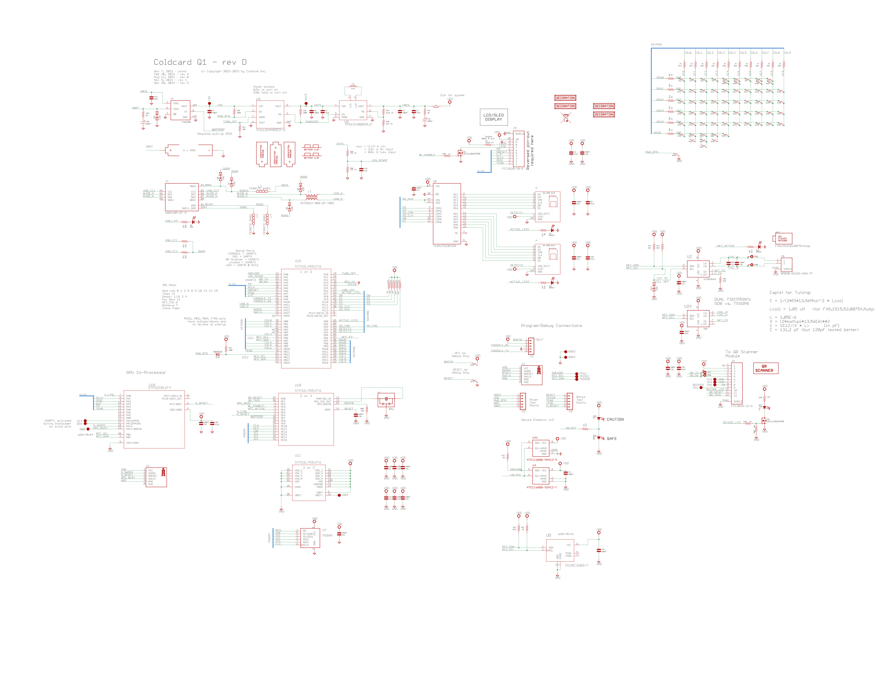
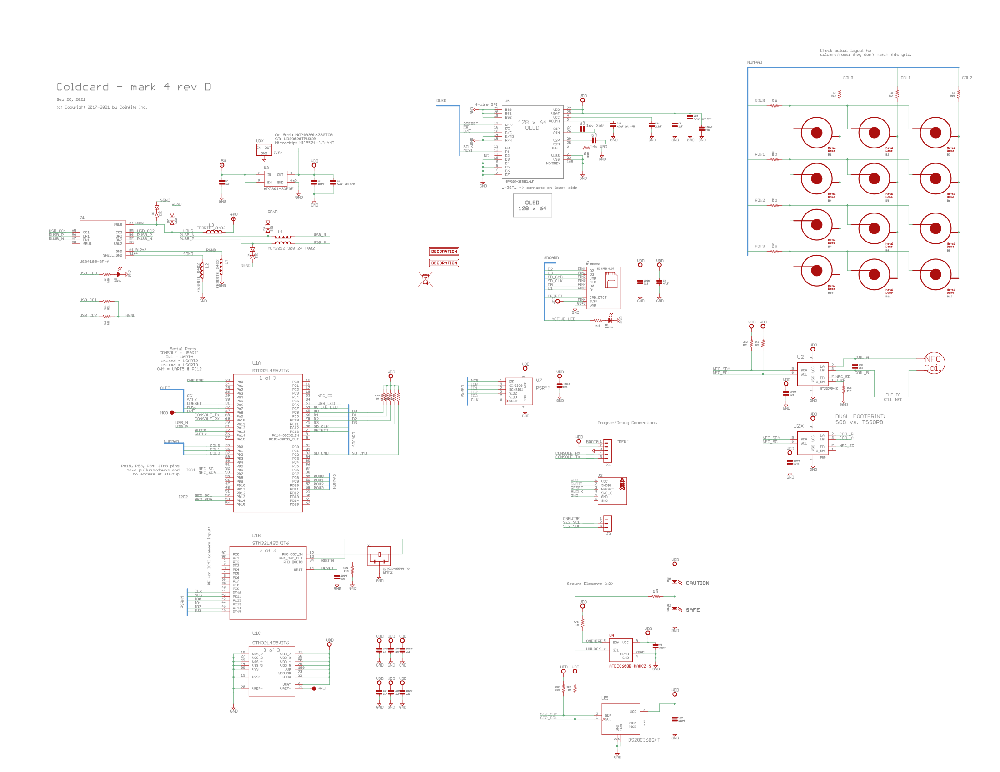
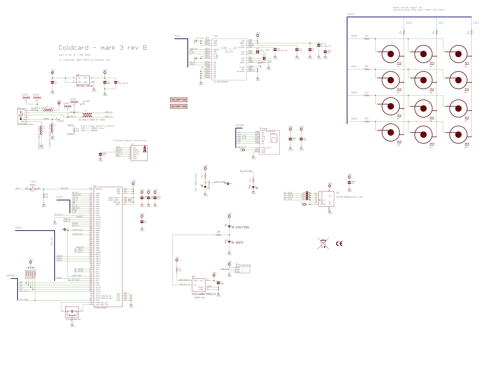

# Coldcard Hardware Details

This directory contains enough information for you to be able to
build your own Coldcard from off-the-shelf parts.
We are sharing this information for the benefit of security
researchers who wish to analyse the Coldcard more completely.

# Schematic

`schematic-q1d.png`

This is the Q rev D schematic.

`schematic-mark4d.png`

This is the Mark4 rev D schematic.

`schematic-mark3b.png`

This is the Mark3 rev B schematic.

# BOM - Bill of Materials

The parts used in the Coldcard are detailed in this spreadsheet file.
Most of them could be bought on Digikey, but some are direct from suppliers.

Not included are these minor bits:

- the plastic case (custom)
- the secure bag (with barcode serial number)
- pin-recovery card

`bom-q1d.xlsx`

- BOM for Q rev D.

`bom-mark4d.xlsx`

- BOM for Mk3 rev D.

`bom-mark3b.xlsx`

- BOM for Mk3 rev B.

# Important

- No promises that these files are 100% current because we constantly make quality improvements.
- Copyright of these files, and all design elements of the Coldcard remain with Coinkite Inc.
- This information is for research and testing purposes only&mdash;no warranties. 
- **Coinkite does NOT grant license of this information for comercial use.**

