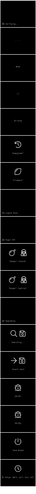

# Boot Loader screens

If you own the Pro version of Font Awesome, copy file `FontAwesome5Pro-Light-300.otf` 
int this directory and the code will use that in preference to the free 4.7 icons.

# Credits

- [Fontawesome version 4.7.0 (free version)](http://fontawesome.io/)

- [Zevv-pepp](http://zevv.nl/play/code/zevv-peep/)
